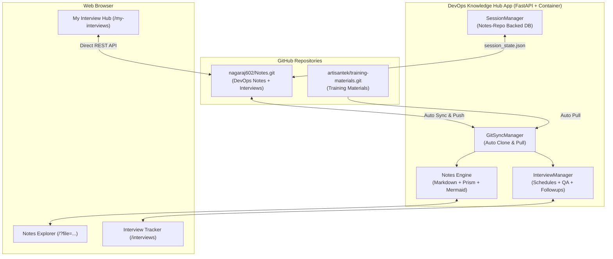

# 🚀 DevOps Knowledge Portal & Interview Hub

A modern, production-grade DevOps knowledge portal, interactive notes reader, and full-featured **Interview Tracker & Question Bank**. It automatically synchronizes notes from multiple GitHub repositories, provides instant search with in-page jump highlights, renders interactive Mermaid flowcharts with high-resolution zooming, and persists interview schedules & Q&A directly into your GitHub repository with zero local-device dependency.

---

## 📑 Table of Contents (Click to Jump)

- [1. Architecture & Overview](#1-architecture--overview)
  - [1.1 Multi-Repository Synchronization](#11-multi-repository-synchronization)
- [2. Universal 1-Click Deployment Script (`deploy.sh`)](#2-universal-1-click-deployment-script-deploysh)
  - [2.1 Features & Supported Environments](#21-features--supported-environments)
  - [2.2 Docker Hub Multi-Account Push Handling](#22-docker-hub-multi-account-push-handling)
- [3. Deployment Guides](#3-deployment-guides)
  - [3.1 Docker Compose (Recommended for GCP & Local)](#31-docker-compose-recommended-for-gcp--local)
  - [3.2 Cloudflare Tunnel Setup (Zero GCP Inbound Ports Needed)](#32-cloudflare-tunnel-setup-zero-gcp-inbound-ports-needed)
  - [3.3 Docker Desktop Kubernetes Deployment](#33-docker-desktop-kubernetes-deployment)
  - [3.4 Production Kubernetes (Kubeadm) Deployment](#34-production-kubernetes-kubeadm-deployment)
  - [3.5 Standalone Docker Container (`docker run`)](#35-standalone-docker-container-docker-run)
  - [3.6 GCP VM Automated Shutdown (11:00 PM IST) & Startup (6:00 AM IST)](#36-gcp-vm-automated-shutdown-1100-pm-ist--startup-600-am-ist)
- [4. Key Application Features](#4-key-application-features)
  - [4.1 Notes Explorer & Search](#41-notes-explorer--search)
  - [4.2 My Interview Hub & Personal Tracker (`/my-interviews`)](#42-my-interview-hub--personal-tracker-my-interviews)
  - [4.3 Nagaraj Interview Schedule & Q&A Hub (`/interviews`)](#43-nagaraj-interview-schedule--qa-hub-interviews)
  - [4.4 Old IQ Questions Bank (`/old-iq-questions`)](#44-old-iq-questions-bank-old-iq-questions)
- [5. Secure GitHub Authentication & Multi-User Sync](#5-secure-github-authentication--multi-user-sync)
- [6. Project Structure](#6-project-structure)
- [7. API Reference](#7-api-reference)
- [8. Local Development Setup](#8-local-development-setup)

---

## 1. Architecture & Overview



### 1.1 Multi-Repository Synchronization
The portal seamlessly aggregates multiple repositories into an integrated navigation tree:
1. **ArtisanTek Training Materials (`artisantek/training-materials.git`)**:
   * Stored at: `/app/data/notes/training-materials` (branch: `master`).
   * Public repository: Clones and pulls without credentials.
   * Auto-sync worker runs every 5 minutes in the background.
2. **DevOps Notes & Interviews (`nagaraj602/Notes.git`)**:
   * Stored at: `/app/data/notes/devops-notes` (branch: `main`).
   * Stored on persistent volume (`devops_hub_notes_data`), ensuring zero data loss across container restarts.

---

## 2. Universal 1-Click Deployment Script (`deploy.sh`)

The repository includes a single, cross-platform interactive Bash script: [`deploy.sh`](./deploy.sh).
It is tested and compatible with:
* **Windows** (using **Git Bash**)
* **Linux** (**Ubuntu**, **Debian**, **GCP Compute Engine VMs**)
* **macOS**

### 2.1 Running the Script
Open Git Bash (on Windows) or SSH terminal (on Ubuntu/GCP):
```bash
cd devops-notes-portal-web-app
chmod +x deploy.sh
./deploy.sh
```

You will be greeted with an interactive menu:
```text
========================================================================
     🚀 DevOps Knowledge Portal & Interview Hub Deployer
========================================================================
 Environment : Linux (Ubuntu) / Windows (Git Bash)
 Directory   : /path/to/devops-notes-portal-web-app
 Image Target: nagarajkamath602/devops-hub-notes-artisantek-training-mterial-interview-questions:latest
========================================================================

Choose an action:
  1) [Docker Compose] Deploy / update app using Docker Compose
  2) [Docker Desktop K8s] Build, push & deploy to Docker Desktop Kubernetes
  3) [Kubeadm Cluster] Deploy to production / multi-node Kubernetes cluster
  4) [Docker Run] Run standalone container with persistent volume
  5) [GCP Ubuntu Server Setup] Automated Setup (Docker + Compose + App + Cloudflare)
  6) [Cloudflare Tunnel] Setup zero-port secure HTTPS tunnel
  7) [Build & Push Only] Build image locally & push to Docker Hub (with auth fix)
  8) [GCP VM Scheduler] Setup 11:00 PM Shutdown / 6:00 AM Startup Schedule
  q) Quit
```

### 2.2 Docker Hub Multi-Account Push Handling
> [!IMPORTANT]
> **Account Switching Detection**: If you add new features and build the Docker image locally on your machine, you might already be logged into a different personal or corporate Docker Hub account.
>
> If `docker push` fails with `denied: requested access to the resource is denied` or `unauthorized`, [`deploy.sh`](./deploy.sh) automatically:
> 1. Detects the authorization mismatch.
> 2. Explains that the target repository belongs to `nagarajkamath602`.
> 3. Prompts you to run `docker login -u nagarajkamath602` immediately.
> 4. Automatically retries the push without losing your build!

---

## 3. Deployment Guides

### 3.1 Docker Compose (Recommended for GCP & Local)

Docker Compose is the fastest way to run the portal with persistent storage and health monitoring.

#### Port Mapping Details
In [`docker-compose.yml`](./docker-compose.yml), both port 80 and port 8000 are mapped to the container:
```yaml
ports:
  - "80:8000"
  - "8000:8000"
```
This ensures you can access the app via standard HTTP (`http://<SERVER_IP>`) **or** via port 8000 (`http://<SERVER_IP>:8000`).

#### Launching with Docker Compose
```bash
# 1. Pull latest image from Docker Hub
docker compose pull

# 2. Start container in background
docker compose up -d

# 3. Check container status
docker compose ps

# 4. View startup logs (git sync & Uvicorn startup)
docker compose logs -f devops-hub
```

#### Access URLs
* **Knowledge Portal**: `http://<SERVER_IP>` or `http://<SERVER_IP>:8000`
* **Interview Tracker**: `http://<SERVER_IP>/interviews` or `http://<SERVER_IP>:8000/interviews`
* **Health Check**: `http://<SERVER_IP>/api/health`

---

### 3.2 Cloudflare Tunnel Setup (Zero GCP Inbound Ports Needed)

> [!TIP]
> **Why Cloudflare Tunnel on GCP?**
> * **Zero Open Ports in GCP Firewall**: You do NOT need to open port 80 or 8000 in GCP VPC Firewall rules!
> * **Free HTTPS & DDoS Protection**: Cloudflare provides automatic SSL certificates and masks your GCP VM's IP address.
> * **Works behind NAT & dynamic IPs**.

#### Option A: Quick Free Tunnel (Instant, No Domain Required)
Using [`deploy.sh`](./deploy.sh) Option 5 or 6, or manually on your GCP Ubuntu VM:
```bash
# 1. Install cloudflared
curl -fsSL https://github.com/cloudflare/cloudflared/releases/latest/download/cloudflared-linux-amd64.deb -o cloudflared.deb
sudo dpkg -i cloudflared.deb && rm cloudflared.deb

# 2. Launch quick tunnel in background
nohup cloudflared tunnel --url http://localhost:8000 > /tmp/cloudflared.log 2>&1 &

# 3. Get your public HTTPS URL
sleep 3
grep -o 'https://[-a-zA-Z0-9.]*\.trycloudflare\.com' /tmp/cloudflared.log
```
Your application is immediately accessible worldwide via the printed `https://xxxx.trycloudflare.com` URL!

#### Option B: Cloudflare Zero Trust Named Tunnel (Custom Domain)

Follow these steps to generate your token in Cloudflare and attach a custom domain:

1. **Log in to Cloudflare Zero Trust**:
   * Open [https://one.dash.cloudflare.com](https://one.dash.cloudflare.com).
   * *(If first time, choose a free Team name and select the $0 Free plan)*.
2. **Create a Tunnel**:
   * In the left sidebar, navigate to **Networks** ➔ **Tunnels**.
   * Click **Add a tunnel** (or **Create a tunnel**).
   * Select connector type: **Cloudflared** ➔ click **Next**.
   * Name your tunnel (e.g., `devops-hub-gcp`) ➔ click **Save tunnel**.
3. **Copy the Install Token**:
   * On the *Install and run a connector* page:
     * Operating System: Select **Debian** (for Ubuntu/Debian on GCP).
     * Architecture: Select **64-bit**.
     * Cloudflare displays a command box containing either:
       ```bash
       sudo cloudflared service install eyJhIjoi...
       # or
       cloudflared tunnel run --token eyJhIjoi...
       ```
4. **Install using [`deploy.sh`](./deploy.sh)**:
   * Run `./deploy.sh` on your server ➔ Select Option **6** (Cloudflare Tunnel) ➔ Option **2** (Named Tunnel).
   * Paste the entire command or just the `eyJh...` token. The script automatically extracts the token and installs it as a persistent systemd service (`sudo systemctl enable --now cloudflared`).
5. **Route Your Custom Domain to the App**:
   * In Cloudflare dashboard, click **Next** to open the **Public Hostname** tab.
   * **Subdomain**: e.g., `notes` (will produce `notes.yourdomain.com`).
   * **Domain**: Select your registered domain from the dropdown.
   * **Type**: `HTTP`
   * **URL**: `localhost:8000`
   * Click **Save hostname**.

🎉 Your app is now live securely at `https://notes.yourdomain.com` with automatic SSL and zero open GCP ports!

---

### 3.3 Docker Desktop Kubernetes Deployment

To run on your local laptop using Docker Desktop's built-in Kubernetes:

1. **Verify Kubernetes is enabled in Docker Desktop**:
   Open Docker Desktop Settings > **Kubernetes** > check **Enable Kubernetes**.
2. **Verify `kubectl` context**:
   ```bash
   kubectl config current-context
   # Should output: docker-desktop
   ```
3. **Deploy using [`deploy.sh`](./deploy.sh) (Option 2) or manually**:
   ```bash
   kubectl apply -f k8s/all-in-one.yaml
   ```
4. **Wait for Pod rollout**:
   ```bash
   kubectl rollout status deployment/devops-hub-deployment -n devops-hub --timeout=90s
   ```
5. **Access the application**:
   Docker Desktop automatically routes LoadBalancer services to localhost:
   * **Portal**: `http://localhost:8000`
   * **NodePort**: `http://localhost:30080`
   * **Interview Hub**: `http://localhost:8000/interviews`

---

### 3.4 Production Kubernetes (Kubeadm) Deployment

To deploy onto a multi-node Kubernetes cluster provisioned with `kubeadm` on Ubuntu/Debian Linux:

1. **Verify cluster connectivity**:
   ```bash
   kubectl cluster-info
   kubectl get nodes -o wide
   ```
2. **Ensure Storage Provisioner exists**:
   The manifest includes a `PersistentVolumeClaim` requesting 2Gi storage:
   * If your cluster uses local storage, ensure a default `StorageClass` (e.g. `rancher.io/local-path` or NFS/CSI) is installed.
   * If testing without a dynamic provisioner, create a simple `PersistentVolume` pointing to a host directory.
3. **Apply the manifests**:
   ```bash
   kubectl apply -f k8s/all-in-one.yaml
   ```
4. **Monitor rollout**:
   ```bash
   kubectl rollout status deployment/devops-hub-deployment -n devops-hub --timeout=120s
   kubectl get pods,svc,pvc -n devops-hub -o wide
   ```
5. **Access the application on Kubeadm**:
   * **Via NodePort**: The service defines `nodePort: 30080`.
     Open in browser: `http://<ANY_WORKER_NODE_IP>:30080`
     *(Ensure port `30080` is open in node firewall: `sudo ufw allow 30080/tcp`)*
   * **Via Port-Forwarding (Quick test)**:
     ```bash
     kubectl port-forward -n devops-hub svc/devops-hub-service 8000:8000
     # Open http://localhost:8000 in your browser
     ```
   * **Via Ingress**: You can route Ingress (e.g. NGINX Ingress Controller) to `service: devops-hub-service`, `port: 8000`.

---

### 3.5 Standalone Docker Container (`docker run`)

To run a standalone container on any server or laptop:
```bash
docker run -d \
  --name devops-hub \
  -p 80:8000 \
  -p 8000:8000 \
  -v devops_hub_notes_data:/app/data/notes \
  -e REPO_URL="https://github.com/nagaraj602/Notes.git" \
  -e REPO_BRANCH="main" \
  -e AUTO_SYNC_INTERVAL_MINUTES=5 \
  -e GEMINI_API_KEY="${GEMINI_API_KEY:-}" \
  -e GEMINI_MODEL="gemini-3.8-flash-high" \
  --restart unless-stopped \
  nagarajkamath602/devops-hub-notes-artisantek-training-mterial-interview-questions:v6.8.0
```

---

### 3.6 GCP VM Automated Shutdown (11:00 PM IST) & Startup (6:00 AM IST)

To reduce cloud hosting costs on Google Cloud Platform, schedule your Compute Engine VM to shut down overnight and turn back on every morning.

#### Using `gcloud` CLI (or [`deploy.sh`](./deploy.sh) Option 8)

1. **Create the Instance Schedule Policy** (`Asia/Kolkata` timezone):
   ```bash
   gcloud compute resource-policies create instance-schedule devops-daily-schedule \
     --region=asia-south1 \
     --vm-start-schedule="0 6 * * *" \
     --vm-stop-schedule="0 23 * * *" \
     --timezone="Asia/Kolkata" \
     --description="Daily auto-start at 6:00 AM IST and shutdown at 11:00 PM IST"
   ```

2. **Grant Compute Engine Service Account instance power management permissions**:
   ```bash
   PROJECT_ID=$(gcloud config get-value project)
   PROJECT_NUMBER=$(gcloud projects describe $PROJECT_ID --format="value(projectNumber)")
   SERVICE_ACCOUNT="service-${PROJECT_NUMBER}@compute-system.iam.gserviceaccount.com"

   gcloud projects add-iam-policy-binding $PROJECT_ID \
     --member="serviceAccount:${SERVICE_ACCOUNT}" \
     --role="roles/compute.instanceAdmin.v1"
   ```

3. **Attach the Schedule to your VM**:
   ```bash
   gcloud compute instances add-resource-policies <YOUR_VM_NAME> \
     --zone=asia-south1-a \
     --resource-policies=devops-daily-schedule
   ```

4. **Ensure Docker auto-starts on boot**:
   ```bash
   sudo systemctl enable docker
   ```
   With `--restart unless-stopped` on Docker Compose, your application starts immediately when the VM boots at 6:00 AM IST!

---

## 4. Key Application Features

### 4.1 Notes Explorer & Search
* **Multi-Repository Sidebar**: Seamlessly explores `ArtisanTek Training Materials` and `nagaraj602 DevOps Notes`.
* **Locate & Jump Search**: Real-time full-text search across all markdown notes with keyword highlighting and `Enter`/`Shift+Enter` navigation.
* **Interactive Mermaid Flowcharts**: Auto-renders architecture flowcharts with zoom in/out, pan, and full-screen lightbox preview.
* **Typography Controller**: Change reader font family (`Sans`, `Inter`, `Mono`, `Serif`), font size, and line height dynamically.

### 4.2 My Interview Hub & Personal Tracker (`/my-interviews`)
* **Zero-Login Architecture**: Allows any visitor or student to track interviews without needing an account on your server.
* **Client-Side GitHub REST API Sync**: Personal Access Tokens (PATs) and repository URLs are stored **strictly in the user's browser `localStorage`**. The server never sees or stores visitor tokens.
* **YouTube Video Recording Links**: Attach YouTube interview recording links to schedules and question sets.
* **Dynamic Sorting**: Automatically re-ranks companies dynamically based on latest interview activity date.
* **JSON Backup & Restore**: 1-click export and import of all interview records.

### 4.3 Nagaraj Interview Schedule & Q&A Hub (`/interviews`)
* **Today's Live Schedule Banner**: Real-time badges for `🔴 HAPPENING NOW`, `⏳ Upcoming Today`, and `🏁 Concluded`.
* **YouTube Interview Recordings**: Direct watch buttons and preview links for recorded interview discussions.
* **Hierarchical Grouping**: Questions grouped under dedicated Company banners and Round cards.
* **Multi-Category Auto-Detection**: Auto-detects and tags questions across 17 DevOps categories (`Linux`, `Shell script`, `jenkins`, `Github`, `Build tools`, `Docker`, `AWS`, `Kubernetes`, `terraform`, `Ansible`, `jira`, `scrum`, `Agile`, `Monitoring tools`, `python`, `Azure`, `AI tool`).

### 4.4 Old IQ Questions Bank (`/old-iq-questions`)
* **Dedicated Navigation Menu**: Parses markdown question banks from the `Interview Questions/` repository directory.
* **Collapsible Hierarchy**: Company ➔ Round ➔ Category ➔ Question & Senior-Level Answer Accordion.
* **Instant Client-Side Filtering**: Category pill counters and instant search across question text and answers.

---

## 5. Secure GitHub Authentication & Multi-User Sync

1. **Visitor Storage (Zero Leakage)**:
   * On `/my-interviews`, visitor GitHub tokens are stored **only in the visitor's local browser**.
2. **Server-Side Push Credentials (`.git_token`)**:
   * For the official Nagaraj Notes showcase, enter your GitHub PAT in `/settings`.
   * It is securely written to `/app/data/notes/.git_token` (on the persistent volume outside the git clone) and ignored by `.gitignore`.

---

## 6. Project Structure

```text
devops-notes-portal-web-app/
├── app/
│   ├── config.py                 # Multi-repository configuration & env overrides
│   ├── git_sync.py               # Background Git sync engine
│   ├── interview_hub.py          # Schedules, Q&A, and auto-categorization
│   ├── old_iq_manager.py         # Dedicated parser for 'Interview Questions/'
│   ├── session_manager.py        # Notes-repo backed session database
│   ├── markdown_engine.py        # Markdown parser with code highlighting
│   ├── main.py                   # FastAPI backend endpoints & lifespan sync
│   └── templates/
│       ├── base.html             # Main layout, nav header
│       ├── index.html            # Notes tree, viewer, mermaid & typography
│       ├── interviews.html       # Nagaraj interview tracker & Q&A uploader
│       ├── my_interviews.html    # Zero-login personal tracker with browser sync
│       └── old_iq.html           # Dedicated Old IQ questions viewer
├── k8s/
│   └── all-in-one.yaml           # Complete Kubernetes manifests (Deployment, SVC, PVC)
├── Dockerfile                    # Multi-stage optimized Docker build
├── docker-compose.yml            # Docker Compose with dual-port mapping & healthchecks
├── deploy.sh                     # Universal 1-Click interactive deployer (Git Bash & Linux)
├── requirements.txt              # Python dependencies
└── README.md                     # Documentation & Deployment Guide
```

---

## 7. API Reference

| Endpoint | Method | Description |
| :--- | :--- | :--- |
| `GET /api/health` | `GET` | Container health check endpoint (returns status & last sync) |
| `GET /api/tree` | `GET` | Returns file tree structure of synced repositories |
| `GET /api/file?path={path}` | `GET` | Fetches parsed HTML & raw Markdown of a note |
| `GET /api/search?q={query}` | `GET` | Full-text search across all notes |
| `POST /api/sync` | `POST` | Manually triggers immediate Git sync with remote repos |
| `GET /api/old-iq/data` | `GET` | Retrieves parsed companies and questions from `Interview Questions/` |
| `GET /api/old-iq/stats` | `GET` | Returns aggregate metrics (companies, rounds, questions) |
| `GET /api/interviews/schedules`| `GET` | Returns all interview schedules |
| `POST /api/interviews/schedules`| `POST` | Creates a new interview schedule |
| `PUT /api/interviews/schedules/{id}`| `PUT` | Updates an interview schedule |
| `DELETE /api/interviews/schedules/{id}`| `DELETE` | Deletes an interview schedule |
| `POST /api/interviews/questions`| `POST` | Adds a single interview question |
| `PUT /api/interviews/questions/{id}`| `PUT` | Updates question text, answer, and category tags |
| `DELETE /api/interviews/questions/{id}`| `DELETE` | Deletes a single question |

---

## 8. Local Development Setup

1. **Clone the repository**:
   ```bash
   git clone https://github.com/nagaraj602/Notes.git
   cd Notes/devops-notes-portal-web-app
   ```

2. **Create Python virtual environment**:
   ```bash
   python -m venv venv
   # On Windows (Git Bash):
   source venv/Scripts/activate
   # On Linux/macOS:
   source venv/bin/activate
   ```

3. **Install dependencies**:
   ```bash
   pip install -r requirements.txt
   ```

4. **Run development server**:
   ```bash
   uvicorn app.main:app --host 0.0.0.0 --port 8000 --reload
   ```

5. **Open browser**:
   * Knowledge Portal: `http://localhost:8000`
   * Interview Hub: `http://localhost:8000/interviews`