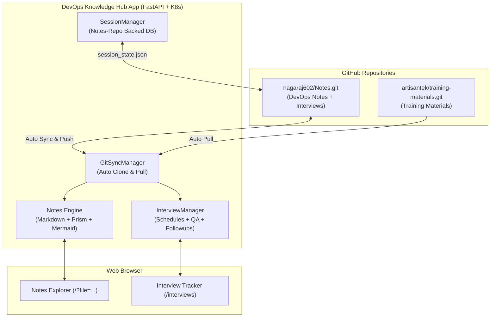

# 🚀 DevOps Knowledge Portal & Nagaraj Interview Hub

A modern, production-grade DevOps knowledge portal, interactive notes reader, and full-featured **Interview Tracker & Question Bank**. Automatically synchronizes with GitHub repositories, provides instant search with in-page jump highlights, renders interactive Mermaid flowcharts with high-resolution zooming, and persists interview schedules & Q&A directly into your GitHub repository with zero local-device dependency.

---

## 📑 Table of Contents (Click to Jump)

- [1. Overview & Architecture](#1-overview--architecture)
  - [1.1 Multi-Repository Architecture & ArtisanTek Sync](#11-multi-repository-architecture--artisantek-sync)
- [2. Key Features](#2-key-features)
  - [2.1 Notes Explorer & Search](#21-notes-explorer--search)
  - [2.2 My Interview Hub & Personal Tracker (`/my-interviews`)](#22-my-interview-hub--personal-tracker-my-interviews)
  - [2.3 Nagaraj Interview Schedule & Q&A Hub (`/interviews`)](#23-nagaraj-interview-schedule--qa-hub-interviews)
  - [2.4 Old IQ Questions Bank (`/old-iq-questions`)](#24-old-iq-questions-bank-old-iq-questions)
  - [2.5 Repository-Backed Session Database & URL Persistence](#25-repository-backed-session-database--url-persistence)
- [3. Deployment Guide (Kubernetes, Docker & GCP)](#3-deployment-guide-kubernetes-docker--gcp)
  - [3.1 Standard Kubernetes Deployment (Docker Desktop, Minikube, Kind)](#31-standard-kubernetes-deployment-docker-desktop-minikube-kind)
  - [3.2 K3s Lightweight Kubernetes Deployment (Linux Server / VM)](#32-k3s-lightweight-kubernetes-deployment-linux-server--vm)
  - [3.3 Standalone Docker Container Deployment (GCP / VPS / Local)](#33-standalone-docker-container-deployment-gcp--vps--local)
  - [3.4 Automated GCP VM Shutdown (11:00 PM IST) & Startup (6:00 AM IST)](#34-automated-gcp-vm-shutdown-1100-pm-ist--startup-600-am-ist)
- [4. Secure GitHub Authentication & Zero-Leakage Multi-User Sync](#4-secure-github-authentication--zero-leakage-multi-user-sync)
  - [4.1 Multi-User Zero-Login PAT Storage (Browser `localStorage`)](#41-multi-user-zero-login-pat-storage-browser-localstorage)
  - [4.2 Server-Side PAT for Nagaraj Interview Hub (`.git_token`)](#42-server-side-pat-for-nagaraj-interview-hub-git_token)
  - [4.3 GitHub Deploy Keys Setup](#43-github-deploy-keys-setup)
- [5. Project Structure](#5-project-structure)
- [6. API Reference](#6-api-reference)
- [7. Local Development Setup](#7-local-development-setup)

---

## 1. Overview & Architecture



### 1.1 Multi-Repository Architecture & ArtisanTek Sync
The portal automatically aggregates multiple repositories into an integrated sidebar tree:
1. **ArtisanTek Training Materials (`artisantek/training-materials.git`)**:
   * **Location on Disk / Container**: `/app/data/notes/training-materials`
   * **Branch**: `master`
   * **Authentication**: Public repository (no PAT or credentials needed to clone/pull).
   * **Sync Mechanism**: A background worker (`auto_sync_worker()` in `main.py`) runs every **5 minutes** (`AUTO_SYNC_INTERVAL_MINUTES=5`) calling `git_manager.sync()`. It pulls latest changes via `git pull origin master --rebase`.
   * **Manual Sync**: Clicking the top-right **"Sync All"** button sends a request to `/api/sync` to pull immediately.
2. **DevOps Notes & Interviews (`nagaraj602/Notes.git`)**:
   * **Location on Disk / Container**: `/app/data/notes/devops-notes`
   * **Branch**: `main`
   * **Storage**: Persistent Volume (`devops-hub-notes-pvc` on `/app/data/notes`), ensuring zero data loss across container restarts.

---

## 2. Key Features

### 2.1 Notes Explorer & Search
* **Multi-Repository Synchronization**: Aggregates multiple remote Git repositories (`ArtisanTek Training Materials` and `nagaraj602 DevOps Notes`).
* **Locate & Jump Search**: Real-time full-text search across all notes with automated keyword highlighting, scroll-to-match counter, and `Enter`/`Shift+Enter` navigation.
* **Interactive Architecture Flowcharts**: Mermaid diagram rendering with built-in zoom in/out, pan, and full-screen lightbox preview.
* **Typography Controller**: Change reader font family (`Sans`, `Inter`, `Mono`, `Serif`), font size, and font weight on the fly.
* **Accordion Question Collapsing**: Technical interview question notes format with collapsible dropdown answers and 1-click **Expand All / Collapse All**.

### 2.2 My Interview Hub & Personal Tracker (`/my-interviews`)
* **Multi-User Zero-Login Architecture**: Allows any visitor to schedule their own interviews, log questions, and track offers without needing a login account on the server.
* **Zero Token Leakage (Browser `localStorage`)**:
  * The visitor's Personal Access Token (PAT) and repository URL are stored **strictly in their browser** (`localStorage`).
  * The server NEVER stores visitor tokens on disk or shares them across visitors.
* **Direct GitHub REST API Sync**:
  * Pushes schedules (`schedules.json`), question bank (`questions.json`), rounds (`rounds.json`), and formatted Markdown (`README.md` and `{Company}.md`) directly from the browser to the user's personal GitHub repository using the GitHub REST API.
  * 1-click **"Pull from Repo"** loads existing records from GitHub on any new machine or browser.
* **Dynamic Schedule Sorting**:
  * Automatically sorts companies dynamically based on latest interview activity date.
  * Interactive sort control: *Latest Activity (Recent First)*, *Earliest First*, *Company Name (A-Z)*, *Most Questions Banked*.
* **Backup & Restore**: 1-click JSON Export & Import backup buttons.

### 2.3 Nagaraj Interview Schedule & Q&A Hub (`/interviews`)
* **Dynamic Schedule-Based Sorting**:
  * Automatically updates company order based on the latest attended/concluded round date (e.g. if Company A has Round 1 on 18 Aug and Round 2 on 1 Sep, and Company B has a round on 25 Aug, Company B is listed first until Round 2 of Company A takes place, at which point Company A automatically moves to the top).
  * Interactive sort control dropdown (*Latest Activity*, *Earliest / Oldest First*, *Company Name*, *Most Questions*).
* **Today's Live Schedule Banner**: Prominently highlights interviews happening today with real-time status badges (`🔴 HAPPENING NOW`, `⏳ Upcoming Today`, `🏁 Concluded`).
* **Dedicated Metric Cards**: 5 dedicated interactive cards for *Total Attended*, *Total Companies*, *This Week's Activity*, *Upcoming Scheduled*, and *Questions Bank* with detailed summary modals.
* **Hierarchical Company & Round Grouping**: Questions are grouped under dedicated Company banners and Round sub-cards, eliminating redundant repetitions on individual question cards.
* **View Mode Switcher**: 1-click toggle between **`🏢 By Company & Round`** (hierarchical structure) and **`📋 Flat List`** (topic-based question list).
* **3-Level Collapsible Hierarchy (Default Collapsed)**: Company banners, Round sections, and Question cards are all independently collapsible with animated chevrons, starting in a clean, collapsed state by default.
* **Smart Search & Filter**:
  * **Search by Company Name or Keywords**: Real-time search across companies, rounds, question titles, and markdown answers.
  * **Auto-Expand on Search**: Matching company and round sections automatically expand during search for instant visibility.
  * **Company Filter Dropdown**: Dedicated dropdown to quickly isolate questions by company alongside the 17 category topic pills.
* **Company & Round Deletion**: Full management options to delete an entire company (and all associated rounds/Q&A) or delete a specific round with instant confirmation prompts.
* **Interactive Calendar Strip & Month View**: Displays Company Name, Round Name, and Start–End Time ranges (`10:00 – 11:00`).
* **Interview Experience & Feedback**: Record interview difficulty (`Easy`, `Moderate`, `Hard`, `Challenging`), focus areas, and overall feedback.
* **Multi-Category Auto-Detection**: Auto-detects and tags questions across 17 categories (`Linux`, `Shell script`, `jenkins`, `Github`, `Build tools`, `Docker`, `AWS`, `Kubernetes`, `terraform`, `Ansible`, `jira`, `scrum`, `Agile`, `Monitoring tools`, `python`, `Azure`, `AI tool`).
* **Inline Question & Category Editor**: Edit questions, answers, difficulty, and assign/unassign multiple categories with 1 click.

### 2.3 Old IQ Questions Bank (`/old-iq-questions`)
* **Dedicated Navigation Menu**: Independent top navigation item **"Old IQ Questions"** linking directly to `/old-iq-questions`.
* **Zero Interference with `Nagaraj_interviews`**: Exclusively parses markdown files from the `Interview Questions/` repository directory (`0. Basic general interview questions.md`, `0_1. General questions part 2.md`, `1. 23-Aug-2026 from whatsapp.md`, and `2. 9-Sep-2026 from discord.md`).
* **Hierarchical Collapsible View**:
  * **Company Level**: Collapsible glassmorphism cards with company logo emojis (`🏢`), round count badges, and question counters.
  * **Round Level**: Nested collapsible sections with round badges (e.g., `Level 1`, `Level 2`, `HackerRank Assessment`, `Manager`) and timestamps.
  * **Category Grouping**: Grouped cleanly under categorized badges (`CI/CD`, `Docker`, `Kubernetes`, `AWS / Cloud`, `Terraform / IaC`, `Linux`, `Security`, etc.).
  * **Question & Answer Accordion**: Questions display collapsible answers by default (`● Question` ➔ expand to reveal senior-level production answer).
* **Instant Client-Side Search**: Sub-millisecond filtering across question text, answer body, company name, and categories.
* **Category Filter Pills**: 1-click filter pills displaying question count per category (e.g., `Kubernetes (340)`, `CI/CD (280)`, `AWS / Cloud (310)`).
* **Company Quick Selector**: Dropdown to instantly jump to any of the 50+ companies.
* **1-Click Expand / Collapse All**: Globally expand or collapse all companies, rounds, and answers with a single click.
* **Prism.js Syntax Highlighting**: Production-grade YAML, Bash, Python, HCL, Groovy, and JSON code snippets rendered with copy buttons.

### 2.4 Repository-Backed Session Database & URL Persistence
* **Zero Local-Device Dependency**: Session state is persisted directly into `Nagaraj_interviews/session_state.json` inside your GitHub repository.
* **URL Sync (`pushState`)**: Browser address bar updates dynamically (e.g. `/?file=devops-notes/Interview%20Questions/1.%2023-Aug-2026.md`).
* **Reload & Share**: Refreshing (`F5`) or sharing URLs opens the exact note and auto-expands all parent folders in the sidebar.

---

## 3. Deployment Guide (Kubernetes & K3s)

### 3.1 Standard Kubernetes Deployment (Docker Desktop, Minikube, Kind)
Deploy the entire application stack (Deployment, Service, PVC, ConfigMap) to any local or cloud Kubernetes cluster:

1. **Verify your Kubernetes cluster is connected**:
   ```bash
   kubectl cluster-info
   ```

2. **Deploy using the all-in-one manifest**:
   ```bash
   kubectl apply -f k8s/all-in-one.yaml
   ```

3. **Verify the rollout status**:
   ```bash
   kubectl rollout status deployment/devops-hub-deployment -n devops-hub
   ```

4. **Verify running Pod and Service**:
   ```bash
   kubectl get pods,svc,pvc -n devops-hub
   ```

5. **Access the application**:
   * **Knowledge Portal**: `http://localhost:8000`
   * **Interview Tracker & Question Hub**: `http://localhost:8000/interviews`
   *(If running on a remote cluster without LoadBalancer, forward the port: `kubectl port-forward svc/devops-hub-service 8000:8000 -n devops-hub`)*

---

### 3.2 K3s Lightweight Kubernetes Deployment (Any Linux Server / VM)
[K3s](https://k3s.io/) is an official, lightweight, CNCF-certified Kubernetes distribution packaged as a single binary (< 100MB). It is perfect for running on any Linux server (Ubuntu, Debian, CentOS, AlmaLinux, Rocky) or small VPS:

1. **Install K3s in one command on your server**:
   ```bash
   curl -sfL https://get.k3s.io | sh -
   ```

2. **Configure `kubectl` permissions for regular users**:
   ```bash
   mkdir -p ~/.kube
   sudo cp /etc/rancher/k3s/k3s.yaml ~/.kube/config
   sudo chown $(id -u):$(id -g) ~/.kube/config
   export KUBECONFIG=~/.kube/config
   echo "export KUBECONFIG=~/.kube/config" >> ~/.bashrc
   ```

3. **Verify your K3s cluster**:
   ```bash
   kubectl get nodes
   ```

4. **Clone your Notes repository on the server**:
   ```bash
   git clone https://github.com/nagaraj602/Notes.git
   cd Notes/devops-notes-portal-web-app
   ```

5. **Deploy the DevOps Hub**:
   ```bash
   kubectl apply -f k8s/all-in-one.yaml
   ```

6. **Monitor deployment progress**:
   ```bash
   kubectl rollout status deployment/devops-hub-deployment -n devops-hub
   kubectl get pods -n devops-hub -w
   ```

7. **Access the portal**:
   * **Knowledge Portal**: `http://<SERVER_PUBLIC_IP>:8000`
   * **Interview Hub**: `http://<SERVER_PUBLIC_IP>:8000/interviews`
   *(Ensure port `8000` is allowed in your server firewall / security group, e.g. `sudo ufw allow 8000/tcp`)*

---

### 3.3 Standalone Docker Container Deployment (GCP / VPS / Local)
If you prefer running a standalone container instead of Kubernetes (e.g. on a GCP Compute Engine VM, AWS EC2, or VPS):

1. **Pull the latest image (`v6.6.3`)**:
   ```bash
   docker pull nagarajkamath602/devops-hub-notes-artisantek-training-mterial-interview-questions:v6.6.3
   ```

2. **Run container with persistent volume and auto-restart**:
   ```bash
   docker run -d \
     --name devops-hub \
     -p 8000:8000 \
     -v devops_notes_data:/app/data/notes \
     -e REPO_URL="https://github.com/nagaraj602/Notes.git" \
     -e REPO_BRANCH="main" \
     -e AUTO_SYNC_INTERVAL_MINUTES="5" \
     -e GITHUB_TOKEN="ghp_your_optional_push_token" \
     --restart unless-stopped \
     nagarajkamath602/devops-hub-notes-artisantek-training-mterial-interview-questions:v6.6.3
   ```
   * Access at: **`http://<SERVER_IP>:8000`**
   * The `--restart unless-stopped` flag ensures that when the VM starts or reboots, Docker immediately relaunches the portal container without manual intervention.

---

### 3.4 Automated GCP VM Shutdown (11:00 PM IST) & Startup (6:00 AM IST)
To reduce cloud hosting costs on Google Cloud Platform (GCP), configure Compute Engine **Instance Schedules** to stop the VM at 11:00 PM IST every night and start it at 6:00 AM IST every morning.

#### Option A: Native GCP Instance Schedules (Recommended)

1. **Create the Instance Schedule Policy** with `Asia/Kolkata` timezone:
   ```bash
   gcloud compute resource-policies create instance-schedule devops-daily-schedule \
     --region=asia-south1 \
     --vm-start-schedule="0 6 * * *" \
     --vm-stop-schedule="0 23 * * *" \
     --timezone="Asia/Kolkata" \
     --description="Daily auto-start at 6:00 AM IST and shutdown at 11:00 PM IST"
   ```

2. **Grant Compute Engine Service Account permissions** to manage instance power states:
   ```bash
   PROJECT_ID=$(gcloud config get-value project)
   PROJECT_NUMBER=$(gcloud projects describe $PROJECT_ID --format="value(projectNumber)")
   SERVICE_ACCOUNT="service-${PROJECT_NUMBER}@compute-system.iam.gserviceaccount.com"

   gcloud projects add-iam-policy-binding $PROJECT_ID \
     --member="serviceAccount:${SERVICE_ACCOUNT}" \
     --role="roles/compute.instanceAdmin.v1"
   ```

3. **Attach the Schedule to your Compute Engine VM**:
   ```bash
   gcloud compute instances add-resource-policies devops-notes-vm \
     --zone=asia-south1-a \
     --resource-policies=devops-daily-schedule
   ```

4. **Ensure Docker auto-starts on boot**:
   ```bash
   sudo systemctl enable docker
   ```
   With `--restart unless-stopped` on your container, the portal will be ready and running immediately at 6:00 AM IST!

#### Option B: GCP Cloud Scheduler + Cloud Run Functions
Alternatively, create two Cloud Scheduler cron jobs calling Compute Engine REST API:
* **Stop Job**: `0 23 * * *` (Timezone: `Asia/Kolkata`) ➔ calls `POST https://compute.googleapis.com/compute/v1/projects/{project}/zones/{zone}/instances/{instance}/stop`
* **Start Job**: `0 6 * * *` (Timezone: `Asia/Kolkata`) ➔ calls `POST https://compute.googleapis.com/compute/v1/projects/{project}/zones/{zone}/instances/{instance}/start`

---

## 4. Secure GitHub Authentication & Zero-Leakage Multi-User Sync

### 4.1 Multi-User Zero-Login PAT Storage (Browser `localStorage`)
* **The Problem**: When deploying the web portal publicly on GCP or a shared server without login authentication, multiple users or students may visit the website. If visitor Alice entered her GitHub PAT on the server, visitor Bob could see or overwrite Alice's token.
* **The Solution**: On the **"My Interview"** page (`/my-interviews`), GitHub credentials (PAT, repository URL, branch, and folder) and interview records are stored **strictly in the user's browser `localStorage`**.
* **Zero Server Storage**: The server never stores visitors' private PATs. The browser communicates directly with the GitHub REST API (`https://api.github.com/repos/{owner}/{repo}/contents/{path}`) to push/pull schedules, questions, and markdown docs.

### 4.2 Server-Side PAT for Nagaraj Interview Hub (`.git_token`)
For the official Nagaraj Interviews showcase and notes synchronization to `nagaraj602/Notes`:
1. **Environment Variable**: Pass `GITHUB_TOKEN=ghp_xxxx` in Docker (`-e GITHUB_TOKEN=...`) or Kubernetes ConfigMap/Secret.
2. **Settings UI**: Enter your PAT in `/settings` under *GitHub Push Credentials*. It is saved to `/app/data/notes/.git_token` (on the persistent volume outside the git clone) and `.gitignore` prevents it from ever being committed to Git.

### 4.3 ArtisanTek Training Materials Sync
* The repository `https://github.com/artisantek/training-materials.git` is cloned to `/app/data/notes/training-materials`.
* It is a public repository, so cloning and pulling require no PAT or credentials.
* It auto-syncs every 5 minutes and upon clicking **Sync All**.

### 4.3 Method C: Direct In-Portal UI Configuration (Easiest)
You can configure and test your GitHub push credentials directly from the web browser:
1. Open the portal and navigate to **Settings** (`/settings`).
2. Scroll to the **GitHub Push Credentials & Personal Access Token (PAT)** card.
3. Paste your GitHub token into the input field.
4. Click **Save & Test Push**.
5. The portal will automatically write the token to the persistent volume (`/app/data/notes/.git_token`), compile the human-readable Markdown docs, execute a test Git commit and push, and report live success status.

---

### 4.4 Automated Human-Readable GitHub Persistence (`Nagaraj_interviews/`)
Whenever you add or update interview schedules, notes, or technical questions in the portal, the app generates and syncs human-readable Markdown directly into the GitHub repository:
* **`Nagaraj_interviews/README.md`**: High-level dashboard containing:
  * Summary metrics table (Total Schedules, Tracked Companies, Banked Questions, Completed Rounds).
  * Comprehensive Interview Schedules & Tracker table with Date, Time (IST), Company Link, Role, Round, Status, Difficulty, and Meeting Links.
  * Direct clickable index to all company interview files.
* **`Nagaraj_interviews/<Company>.md`**: Dedicated document per company containing:
  * Company interview schedules and status breakdown.
  * Compensation / CTC and Job Description requirements.
  * Candidate experience notes and takeaways.
  * All technical questions & answers grouped by round with tags, difficulty, and collapsible solutions.

---

## 5. Project Structure

```
devops-notes-portal-web-app/
├── app/
│   ├── config.py                 # Multi-repository configuration
│   ├── git_sync.py               # Background Git sync engine
│   ├── interview_hub.py          # Schedules, Q&A, and auto-categorization (Nagaraj Interviews)
│   ├── old_iq_manager.py         # Dedicated parser & engine for 'Interview Questions/' folder
│   ├── session_manager.py        # Notes-repo backed session database
│   ├── markdown_engine.py        # Markdown parser with code highlighting
│   ├── main.py                   # FastAPI backend endpoints
│   └── templates/
│       ├── base.html             # Main layout, nav header with Nagaraj Interview & Old IQ Questions
│       ├── index.html            # Notes tree, viewer, mermaid & typography controls
│       ├── interviews.html       # Nagaraj interview tracker, today's schedule, Q&A uploader
│       └── old_iq.html           # Dedicated Old IQ questions viewer (Company ➔ Round ➔ Category ➔ Q&A)
├── k8s/
│   └── all-in-one.yaml           # Complete Kubernetes manifests (v6.6.0)
├── Dockerfile                    # Multi-stage optimized Docker build
├── requirements.txt              # Python package dependencies
├── deploy.ps1                    # 1-Click build, push & deploy script
└── README.md                     # Documentation & Cloud Deployment Guide
```

---

## 6. API Reference

| Endpoint | Method | Description |
| :--- | :--- | :--- |
| `GET /api/tree` | `GET` | Returns file tree structure of synced repositories |
| `GET /api/file?path={path}` | `GET` | Fetches parsed HTML & raw Markdown of a note |
| `GET /api/search?q={query}` | `GET` | Full-text search across all notes |
| `GET /old-iq-questions` | `GET` | Dedicated UI page for Old IQ Questions bank |
| `GET /api/old-iq/data` | `GET` | Retrieves parsed companies, rounds, and questions from `Interview Questions/` |
| `GET /api/old-iq/stats` | `GET` | Retrieves aggregate metrics (total companies, rounds, questions, categories) |
| `GET /api/interviews/stats` | `GET` | Retrieves interview statistics, today's list & company records |
| `GET /api/interviews/schedules`| `GET` | Returns all interview schedules |
| `POST /api/interviews/schedules`| `POST` | Creates a new interview schedule with start & end time |
| `PUT /api/interviews/schedules/{id}`| `PUT` | Updates an interview schedule |
| `DELETE /api/interviews/schedules/{id}`| `DELETE` | Deletes an interview schedule |
| `DELETE /api/interviews/company?company={name}`| `DELETE` | Permanently deletes a company and all associated rounds & questions |
| `DELETE /api/interviews/company/round?company={name}&round={name}`| `DELETE` | Deletes a specific round and its questions for a company |
| `GET /api/interviews/rounds`| `GET` | Retrieves all available interview rounds (default + custom) |
| `POST /api/interviews/rounds`| `POST` | Creates a new custom interview round |
| `DELETE /api/interviews/rounds/{id}`| `DELETE` | Deletes a custom interview round |
| `POST /api/interviews/questions/bulk`| `POST` | Imports Q&A batch with difficulty & experience notes |
| `GET /api/interviews/questions`| `GET` | Searches & filters question bank by company, category, or keyword |
| `POST /api/interviews/questions`| `POST` | Adds a single interview question |
| `PUT /api/interviews/questions/{id}`| `PUT` | Edits question text, answers, and category assignments |
| `DELETE /api/interviews/questions/{id}`| `DELETE` | Deletes a single question |
| `GET /api/session/state` | `GET` | Reads session state from Notes repository database |
| `POST /api/session/state` | `POST` | Saves session state to Notes repo and syncs with Git |
| `POST /api/sync` | `POST` | Manually triggers immediate Git sync with remote repos |

---

## 7. Local Development Setup

1. **Clone the repository**:
   ```bash
   git clone https://github.com/nagaraj602/Notes.git
   cd Notes/devops-notes-portal-web-app
   ```

2. **Create Python virtual environment**:
   ```bash
   python -m venv venv
   .\venv\Scripts\Activate.ps1   # On Windows
   source venv/bin/activate      # On Linux/macOS
   ```

3. **Install dependencies**:
   ```bash
   pip install -r requirements.txt
   ```

4. **Run development server**:
   ```bash
   uvicorn app.main:app --host 0.0.0.0 --port 8000 --reload
   ```

5. **Open browser**:
   * Knowledge Portal: `http://localhost:8000`
   * Interview Hub: `http://localhost:8000/interviews`