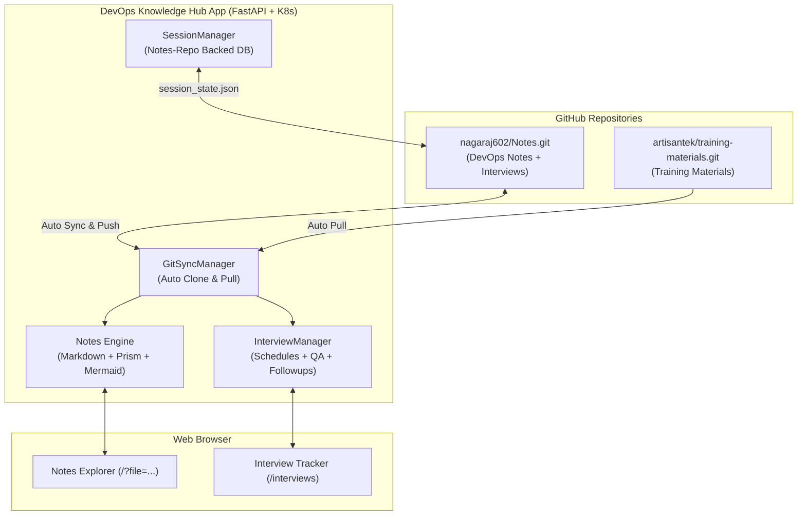

# 🚀 DevOps Knowledge Portal & Nagaraj Interview Hub

A modern, production-grade DevOps knowledge portal, interactive notes reader, and full-featured **Interview Tracker & Question Bank**. Automatically synchronizes with GitHub repositories, provides instant search with in-page jump highlights, renders interactive Mermaid flowcharts with high-resolution zooming, and persists interview schedules & Q&A directly into your GitHub repository with zero local-device dependency.

---

## 📑 Table of Contents (Click to Jump)

- [1. Overview & Architecture](#1-overview--architecture)
- [2. Key Features](#2-key-features)
  - [2.1 Notes Explorer & Search](#21-notes-explorer--search)
  - [2.2 Interview Schedule & Q&A Hub (`/interviews`)](#22-interview-schedule--qa-hub-interviews)
  - [2.3 Repository-Backed Session Database & URL Persistence](#23-repository-backed-session-database--url-persistence)
- [3. Deployment Guide (Kubernetes & K3s)](#3-deployment-guide-kubernetes--k3s)
  - [3.1 Standard Kubernetes Deployment (Docker Desktop, Minikube, Kind)](#31-standard-kubernetes-deployment-docker-desktop-minikube-kind)
  - [3.2 K3s Lightweight Kubernetes Deployment (Any Linux Server / VM)](#32-k3s-lightweight-kubernetes-deployment-any-linux-server--vm)
  - [3.3 Standalone Docker Deployment](#33-standalone-docker-deployment)
- [4. Secure GitHub Authentication (Deploy Keys & PAT)](#4-secure-github-authentication-deploy-keys--pat)
  - [4.1 Method A: GitHub Deploy Keys (Recommended)](#41-method-a-github-deploy-keys-recommended)
  - [4.2 Method B: Fine-Grained Personal Access Token (PAT)](#42-method-b-fine-grained-personal-access-token-pat)
- [5. Project Structure](#5-project-structure)
- [6. API Reference](#6-api-reference)
- [7. Local Development Setup](#7-local-development-setup)

---

## 1. Overview & Architecture



---

## 2. Key Features

### 2.1 Notes Explorer & Search
* **Multi-Repository Synchronization**: Aggregates multiple remote Git repositories (`ArtisanTek Training Materials` and `nagaraj602 DevOps Notes`).
* **Locate & Jump Search**: Real-time full-text search across all notes with automated keyword highlighting, scroll-to-match counter, and `Enter`/`Shift+Enter` navigation.
* **Interactive Architecture Flowcharts**: Mermaid diagram rendering with built-in zoom in/out, pan, and full-screen lightbox preview.
* **Typography Controller**: Change reader font family (`Sans`, `Inter`, `Mono`, `Serif`), font size, and font weight on the fly.
* **Accordion Question Collapsing**: Technical interview question notes format with collapsible dropdown answers and 1-click **Expand All / Collapse All**.

### 2.2 Interview Schedule & Q&A Hub (`/interviews`)
* **Today's Live Schedule Banner**: Prominently highlights interviews happening today with real-time status badges (`🔴 HAPPENING NOW`, `⏳ Upcoming Today`, `🏁 Concluded`).
* **Dedicated Metric Cards**: 5 dedicated interactive cards for *Total Attended*, *Total Companies*, *This Week's Activity*, *Upcoming Scheduled*, and *Questions Bank* with detailed summary modals.
* **Hierarchical Company & Round Grouping**: Questions are grouped under dedicated Company banners and Round sub-cards, eliminating redundant repetitions on individual question cards.
* **View Mode Switcher**: 1-click toggle between **`🏢 By Company & Round`** (hierarchical structure) and **`📋 Flat List`** (topic-based question list).
* **3-Level Collapsible Hierarchy (Default Collapsed)**: Company banners, Round sections, and Question cards are all independently collapsible with animated chevrons, starting in a clean, collapsed state by default.
* **Smart Search & Filter**:
  * **Search by Company Name or Keywords**: Real-time search across companies, rounds, question titles, and markdown answers.
  * **Auto-Expand on Search**: Matching company and round sections automatically expand during search for instant visibility.
  * **Company Filter Dropdown**: Dedicated dropdown to quickly isolate questions by company alongside the 17 category topic pills.
* **Company & Round Deletion**: Full management options to delete an entire company (and all associated rounds/Q&A) or delete a specific round with instant confirmation prompts.
* **Interactive Calendar Strip & Month View**: Displays Company Name, Round Name, and Start–End Time ranges (`10:00 – 11:00`).
* **Interview Experience & Feedback**: Record interview difficulty (`Easy`, `Moderate`, `Hard`, `Challenging`), focus areas, and overall feedback.
* **Multi-Category Auto-Detection**: Auto-detects and tags questions across 17 categories (`Linux`, `Shell script`, `jenkins`, `Github`, `Build tools`, `Docker`, `AWS`, `Kubernetes`, `terraform`, `Ansible`, `jira`, `scrum`, `Agile`, `Monitoring tools`, `python`, `Azure`, `AI tool`).
* **Inline Question & Category Editor**: Edit questions, answers, difficulty, and assign/unassign multiple categories with 1 click.

### 2.3 Repository-Backed Session Database & URL Persistence
* **Zero Local-Device Dependency**: Session state is persisted directly into [`Nagaraj_interviews/session_state.json`](file:///D:/Devops%20training%202026/ArtisanTek%20DevOps%20Jan%202026/12.%20Ai%20coding%20agents/Notes/Nagaraj_interviews/session_state.json) inside your GitHub repository.
* **URL Sync (`pushState`)**: Browser address bar updates dynamically (e.g. `/?file=devops-notes/Interview%20Questions/1.%2023-Aug-2026.md`).
* **Reload & Share**: Refreshing (`F5`) or sharing URLs opens the exact note and auto-expands all parent folders in the sidebar.

---

## 3. Deployment Guide (Kubernetes & K3s)

### 3.1 Standard Kubernetes Deployment (Docker Desktop, Minikube, Kind)
Deploy the entire application stack (Deployment, Service, PVC, ConfigMap) to any local or cloud Kubernetes cluster:

1. **Verify your Kubernetes cluster is connected**:
   ```bash
   kubectl cluster-info
   ```

2. **Deploy using the all-in-one manifest**:
   ```bash
   kubectl apply -f k8s/all-in-one.yaml
   ```

3. **Verify the rollout status**:
   ```bash
   kubectl rollout status deployment/devops-hub-deployment -n devops-hub
   ```

4. **Verify running Pod and Service**:
   ```bash
   kubectl get pods,svc,pvc -n devops-hub
   ```

5. **Access the application**:
   * **Knowledge Portal**: `http://localhost:8000`
   * **Interview Tracker & Question Hub**: `http://localhost:8000/interviews`
   *(If running on a remote cluster without LoadBalancer, forward the port: `kubectl port-forward svc/devops-hub-service 8000:8000 -n devops-hub`)*

---

### 3.2 K3s Lightweight Kubernetes Deployment (Any Linux Server / VM)
[K3s](https://k3s.io/) is an official, lightweight, CNCF-certified Kubernetes distribution packaged as a single binary (< 100MB). It is perfect for running on any Linux server (Ubuntu, Debian, CentOS, AlmaLinux, Rocky) or small VPS:

1. **Install K3s in one command on your server**:
   ```bash
   curl -sfL https://get.k3s.io | sh -
   ```

2. **Configure `kubectl` permissions for regular users**:
   ```bash
   mkdir -p ~/.kube
   sudo cp /etc/rancher/k3s/k3s.yaml ~/.kube/config
   sudo chown $(id -u):$(id -g) ~/.kube/config
   export KUBECONFIG=~/.kube/config
   echo "export KUBECONFIG=~/.kube/config" >> ~/.bashrc
   ```

3. **Verify your K3s cluster**:
   ```bash
   kubectl get nodes
   ```

4. **Clone your Notes repository on the server**:
   ```bash
   git clone https://github.com/nagaraj602/Notes.git
   cd Notes/devops-notes-portal
   ```

5. **Deploy the DevOps Hub**:
   ```bash
   kubectl apply -f k8s/all-in-one.yaml
   ```

6. **Monitor deployment progress**:
   ```bash
   kubectl rollout status deployment/devops-hub-deployment -n devops-hub
   kubectl get pods -n devops-hub -w
   ```

7. **Access the portal**:
   * **Knowledge Portal**: `http://<SERVER_PUBLIC_IP>:8000`
   * **Interview Hub**: `http://<SERVER_PUBLIC_IP>:8000/interviews`
   *(Ensure port `8000` is allowed in your server firewall / security group, e.g. `sudo ufw allow 8000/tcp`)*

---

### 3.3 Standalone Docker Deployment
If you prefer running a standalone container without Kubernetes:

1. **Pull the latest image**:
   ```bash
   docker pull nagarajkamath602/devops-hub-notes-artisantek-training-mterial-interview-questions:v6.5.0
   ```

2. **Run container**:
   ```bash
   docker run -d -p 8000:8000 \
     --name devops-hub \
     --restart unless-stopped \
     nagarajkamath602/devops-hub-notes-artisantek-training-mterial-interview-questions:v6.5.0
   ```
   Access at: **`http://localhost:8000`**

---

## 4. Secure GitHub Authentication (Deploy Keys & PAT)

When hosting the application on a server or shared machine, protect your primary GitHub credentials by using scoped credentials:

### 4.1 Method A: GitHub Deploy Keys (Recommended)
Deploy keys are tied **strictly to your `Notes` repository** and have zero access to any other repositories or account settings:

1. **Generate a dedicated SSH key on your server**:
   ```bash
   ssh-keygen -t ed25519 -C "k3s-notes-sync" -f ~/.ssh/id_notes_deploy -N ""
   ```

2. **Display and copy the public key**:
   ```bash
   cat ~/.ssh/id_notes_deploy.pub
   ```

3. **Add Deploy Key in GitHub**:
   * Go to: `https://github.com/nagaraj602/Notes/settings/keys`
   * Click **Add deploy key**
   * **Title**: `K3s / Linux Server Sync`
   * **Key**: Paste the public key content
   * Check **Allow write access** (allows automated persistence of session states, schedules, and questions directly back to GitHub)
   * Click **Add Key**

4. **Configure SSH client (`~/.ssh/config`)**:
   ```bash
   cat <<EOF >> ~/.ssh/config
   Host github.com
     IdentityFile ~/.ssh/id_notes_deploy
     StrictHostKeyChecking no
   EOF
   chmod 600 ~/.ssh/config ~/.ssh/id_notes_deploy
   ```

---

### 4.2 Method B: Fine-Grained Personal Access Token (PAT)
1. Go to `https://github.com/settings/tokens?type=beta`
2. Click **Generate new token**.
3. **Repository access**: Select *Only select repositories* -> `nagaraj602/Notes`.
4. **Permissions**: Under *Repository permissions*, set `Contents` to **Read and Write**.
5. Set an expiration (e.g. 90 days).
6. Set the token in your Kubernetes configuration or environment.

---

## 5. Project Structure

```
devops-notes-portal/
├── app/
│   ├── config.py                 # Multi-repository configuration
│   ├── git_sync.py               # Background Git sync engine
│   ├── interview_hub.py          # Schedules, Q&A, and auto-categorization
│   ├── session_manager.py        # Notes-repo backed session database
│   ├── markdown_engine.py        # Markdown parser with code highlighting
│   ├── main.py                   # FastAPI backend endpoints
│   └── templates/
│       ├── base.html             # Main layout, nav header, theme, search bar
│       ├── index.html            # Notes tree, viewer, mermaid & typography controls
│       └── interviews.html       # Interview tracker, today's schedule, Q&A uploader
├── k8s/
│   └── all-in-one.yaml           # Complete Kubernetes manifests
├── Dockerfile                    # Multi-stage optimized Docker build
├── requirements.txt              # Python package dependencies
├── deploy.ps1                    # 1-Click build, push & deploy script
└── README.md                     # Documentation & Cloud Deployment Guide
```

---

## 6. API Reference

| Endpoint | Method | Description |
| :--- | :--- | :--- |
| `GET /api/tree` | `GET` | Returns file tree structure of synced repositories |
| `GET /api/file?path={path}` | `GET` | Fetches parsed HTML & raw Markdown of a note |
| `GET /api/search?q={query}` | `GET` | Full-text search across all notes |
| `GET /api/interviews/stats` | `GET` | Retrieves interview statistics, today's list & company records |
| `GET /api/interviews/schedules`| `GET` | Returns all interview schedules |
| `POST /api/interviews/schedules`| `POST` | Creates a new interview schedule with start & end time |
| `PUT /api/interviews/schedules/{id}`| `PUT` | Updates an interview schedule |
| `DELETE /api/interviews/schedules/{id}`| `DELETE` | Deletes an interview schedule |
| `DELETE /api/interviews/company?company={name}`| `DELETE` | Permanently deletes a company and all associated rounds & questions |
| `DELETE /api/interviews/company/round?company={name}&round={name}`| `DELETE` | Deletes a specific round and its questions for a company |
| `GET /api/interviews/rounds`| `GET` | Retrieves all available interview rounds (default + custom) |
| `POST /api/interviews/rounds`| `POST` | Creates a new custom interview round |
| `DELETE /api/interviews/rounds/{id}`| `DELETE` | Deletes a custom interview round |
| `POST /api/interviews/questions/bulk`| `POST` | Imports Q&A batch with difficulty & experience notes |
| `GET /api/interviews/questions`| `GET` | Searches & filters question bank by company, category, or keyword |
| `POST /api/interviews/questions`| `POST` | Adds a single interview question |
| `PUT /api/interviews/questions/{id}`| `PUT` | Edits question text, answers, and category assignments |
| `DELETE /api/interviews/questions/{id}`| `DELETE` | Deletes a single question |
| `GET /api/session/state` | `GET` | Reads session state from Notes repository database |
| `POST /api/session/state` | `POST` | Saves session state to Notes repo and syncs with Git |
| `POST /api/sync` | `POST` | Manually triggers immediate Git sync with remote repos |

---

## 7. Local Development Setup

1. **Clone the repository**:
   ```bash
   git clone https://github.com/nagaraj602/Notes.git
   cd Notes/devops-notes-portal
   ```

2. **Create Python virtual environment**:
   ```bash
   python -m venv venv
   .\venv\Scripts\Activate.ps1   # On Windows
   source venv/bin/activate      # On Linux/macOS
   ```

3. **Install dependencies**:
   ```bash
   pip install -r requirements.txt
   ```

4. **Run development server**:
   ```bash
   uvicorn app.main:app --host 0.0.0.0 --port 8000 --reload
   ```

5. **Open browser**:
   * Knowledge Portal: `http://localhost:8000`
   * Interview Hub: `http://localhost:8000/interviews`