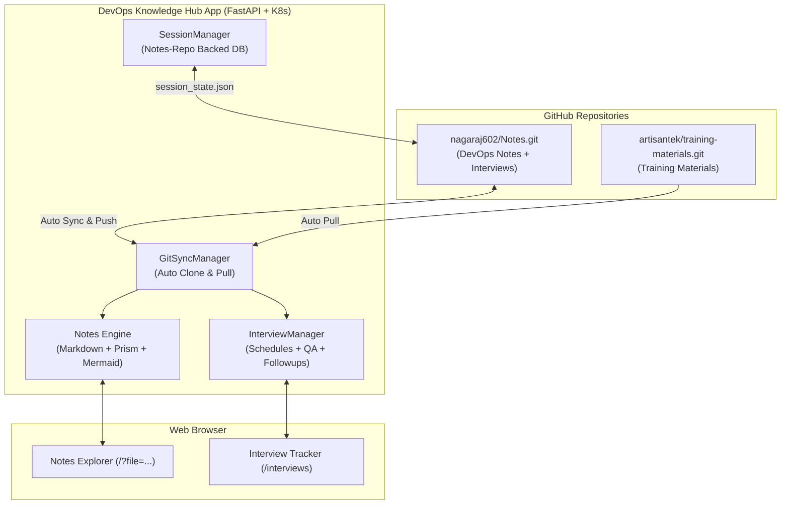

# 🚀 DevOps Knowledge Portal & Nagaraj Interview Hub

A modern, production-grade DevOps knowledge portal, interactive notes reader, and full-featured **Interview Tracker & Question Bank**. Automatically synchronizes with GitHub repositories, provides instant search with in-page jump highlights, renders interactive Mermaid flowcharts with high-resolution zooming, and persists interview schedules & Q&A directly into your GitHub repository with zero local-device dependency.

---

## 📑 Table of Contents (Click to Jump)

- [1. Overview & Architecture](#1-overview--architecture)
- [2. Key Features](#2-key-features)
  - [2.1 Notes Explorer & Search](#21-notes-explorer--search)
  - [2.2 Interview Schedule & Q&A Hub (`/interviews`)](#22-interview-schedule--qa-hub-interviews)
  - [2.3 Repository-Backed Session Database & URL Persistence](#23-repository-backed-session-database--url-persistence)
- [3. Docker Hub Image & Local Deployment](#3-docker-hub-image--local-deployment)
  - [3.1 Pull & Run with Docker](#31-pull--run-with-docker)
  - [3.2 Deploy to Kubernetes (Docker Desktop / Minikube)](#32-deploy-to-kubernetes-docker-desktop--minikube)
- [4. Production Deployment on Oracle Cloud Always Free (K3s Kubernetes)](#4-production-deployment-on-oracle-cloud-always-free-k3s-kubernetes)
  - [4.1 Step 1: Create Oracle Cloud Always Free Account](#41-step-1-create-oracle-cloud-always-free-account)
  - [4.2 Step 2: Create Always-Free Compute Instance](#42-step-2-create-always-free-compute-instance)
  - [4.3 Step 3: Configure Oracle Cloud VCN Firewall](#43-step-3-configure-oracle-cloud-vcn-firewall)
  - [4.4 Step 4: SSH Connect & Configure Server Firewall](#44-step-4-ssh-connect--configure-server-firewall)
  - [4.5 Step 5: Install K3s Lightweight Kubernetes](#45-step-5-install-k3s-lightweight-kubernetes)
  - [4.6 Step 6: Deploy DevOps Hub to K3s](#46-step-6-deploy-devops-hub-to-k3s)
- [5. Secure GitHub Authentication (Zero Account Risk)](#5-secure-github-authentication-zero-account-risk)
  - [5.1 Method A: GitHub Deploy Keys (Recommended)](#51-method-a-github-deploy-keys-recommended)
  - [5.2 Method B: Fine-Grained Personal Access Token (PAT)](#52-method-b-fine-grained-personal-access-token-pat)
- [6. Project Structure](#6-project-structure)
- [7. API Reference](#7-api-reference)
- [8. Local Development Setup](#8-local-development-setup)

---

## 1. Overview & Architecture



---

## 2. Key Features

### 2.1 Notes Explorer & Search
* **Multi-Repository Synchronization**: Aggregates multiple remote Git repositories (`ArtisanTek Training Materials` and `nagaraj602 DevOps Notes`).
* **Locate & Jump Search**: Real-time full-text search across all notes with automated keyword highlighting, scroll-to-match counter, and `Enter`/`Shift+Enter` navigation.
* **Interactive Architecture Flowcharts**: Mermaid diagram rendering with built-in zoom in/out, pan, and full-screen lightbox preview.
* **Typography Controller**: Change reader font family (`Sans`, `Inter`, `Mono`, `Serif`), font size, and font weight on the fly.
* **Accordion Question Collapsing**: Technical interview question notes format with collapsible dropdown answers and 1-click **Expand All / Collapse All**.

### 2.2 Interview Schedule & Q&A Hub (`/interviews`)
* **Today's Live Schedule Banner**: Prominently highlights interviews happening today with real-time status badges (`🔴 HAPPENING NOW`, `⏳ Upcoming Today`, `🏁 Concluded`).
* **Interactive Metric Cards**: Clickable cards for *Total Attended*, *Total Companies*, *This Week's Activity*, and *Questions Bank* with detailed popup modals.
* **Interactive 1-Week Calendar Strip & Month View**: Displays Company Name, Round Name, and Start–End Time ranges (`10:00 – 11:00`).
* **Company-Bound Q&A Upload**: Dropdown is strictly populated with scheduled companies and their scheduled rounds (no random generic round names).
* **Interview Experience & Feedback**: Record interview difficulty (`Easy`, `Moderate`, `Hard`, `Challenging`), focus areas, and overall feedback.
* **Multi-Category Auto-Detection**: Auto-detects and tags questions across 17 categories (`Linux`, `Shell script`, `jenkins`, `Github`, `Build tools`, `Docker`, `AWS`, `Kubernetes`, `terraform`, `Ansible`, `jira`, `scrum`, `Agile`, `Monitoring tools`, `python`, `Azure`, `AI tool`).
* **Inline Question & Category Editor**: Edit questions, answers, and assign/unassign multiple categories with 1 click.

### 2.3 Repository-Backed Session Database & URL Persistence
* **Zero Local-Device Dependency**: Session state is persisted directly into [`Nagaraj_interviews/session_state.json`](file:///D:/Devops%20training%202026/ArtisanTek%20DevOps%20Jan%202026/12.%20Ai%20coding%20agents/Notes/Nagaraj_interviews/session_state.json) inside your GitHub repository.
* **URL Sync (`pushState`)**: Browser address bar updates dynamically (e.g. `/?file=devops-notes/Interview%20Questions/1.%2023-Aug-2026.md`).
* **Reload & Share**: Refreshing (`F5`) or sharing URLs opens the exact note and auto-expands all parent folders in the sidebar.

---

## 3. Docker Hub Image & Local Deployment

### 3.1 Pull & Run with Docker
The pre-built multi-arch image is hosted on Docker Hub:
```bash
docker pull nagarajkamath602/devops-hub-notes-artisantek-training-mterial-interview-questions:latest
```

Run container locally:
```bash
docker run -d -p 8000:8000 --name devops-hub nagarajkamath602/devops-hub-notes-artisantek-training-mterial-interview-questions:latest
```
Access at: **`http://localhost:8000`**

---

### 3.2 Deploy to Kubernetes (Docker Desktop / Minikube)
Using the included all-in-one manifest:
```bash
kubectl apply -f k8s/all-in-one.yaml
kubectl rollout status deployment/devops-hub-deployment -n devops-hub
```

---

## 4. Production Deployment on Oracle Cloud Always Free (K3s Kubernetes)

Oracle Cloud provides **Always Free** cloud infrastructure including an Ampere ARM instance with up to **4 OCPUs and 24 GB RAM** (or 2 AMD x86 VMs with 1 GB RAM each) **free forever**.

### 4.1 Step 1: Create Oracle Cloud Always Free Account
1. Visit **[oracle.com/cloud/free](https://www.oracle.com/cloud/free/)** and click **Start for free**.
2. Complete signup and choose your **Home Region** (e.g. *India South (Hyderabad)* or *India West (Mumbai)*).
3. Complete the temporary identity check (temporary ~$1 verification hold refunded immediately).

---

### 4.2 Step 2: Create Always-Free Compute Instance
1. In the Oracle Cloud Console, navigate to **Compute** -> **Instances** -> **Create Instance**.
2. **Name**: `devops-hub-k3s`
3. **Image**: Choose **Ubuntu 24.04** or **Ubuntu 22.04 LTS Minimal**.
4. **Shape**: Choose **Ampere (ARM)** -> `VM.Standard.A1.Flex` -> Set **2 OCPUs and 12 GB RAM** (or 4 OCPUs / 24 GB RAM).
5. **Networking**: Ensure **"Assign a public IPv4 address"** is checked.
6. **SSH Keys**: Download and save the private SSH key (`ssh-key.key`).
7. Click **Create**.

---

### 4.3 Step 3: Configure Oracle Cloud VCN Firewall
1. In your Instance details, click the **Subnet** link under *Instance Access*.
2. Click **Default Security List**.
3. Click **Add Ingress Rules**:
   * **Source CIDR**: `0.0.0.0/0`
   * **IP Protocol**: `TCP`
   * **Destination Port Range**: `80, 443, 8000, 6443`
   * **Description**: `Allow HTTP, HTTPS, Web App & K8s`
4. Click **Add Ingress Rules**.

---

### 4.4 Step 4: SSH Connect & Configure Server Firewall
From your local terminal (PowerShell / macOS / Linux):
```bash
ssh -i "path/to/ssh-key.key" ubuntu@<YOUR_ORACLE_VM_PUBLIC_IP>
```

Open host iptables firewall rules for web traffic:
```bash
sudo iptables -I INPUT 6 -m state --state NEW -p tcp --dport 80 -j ACCEPT
sudo iptables -I INPUT 6 -m state --state NEW -p tcp --dport 443 -j ACCEPT
sudo iptables -I INPUT 6 -m state --state NEW -p tcp --dport 8000 -j ACCEPT
sudo netfilter-persistent save 2>/dev/null || sudo iptables-save | sudo tee /etc/iptables/rules.v4
```

---

### 4.5 Step 5: Install K3s Lightweight Kubernetes
Install K3s in one command:
```bash
curl -sfL https://get.k3s.io | sh -
```

Configure `kubectl` permissions:
```bash
mkdir -p ~/.kube
sudo cp /etc/rancher/k3s/k3s.yaml ~/.kube/config
sudo chown $(id -u):$(id -g) ~/.kube/config
export KUBECONFIG=~/.kube/config
echo "export KUBECONFIG=~/.kube/config" >> ~/.bashrc
```

Verify the cluster:
```bash
kubectl get nodes
```

---

### 4.6 Step 6: Deploy DevOps Hub to K3s
Clone your Notes repo and deploy:
```bash
git clone https://github.com/nagaraj602/Notes.git
cd Notes/devops-notes-portal
kubectl apply -f k8s/all-in-one.yaml
```

Check deployment status:
```bash
kubectl get pods -n devops-hub -w
```

Open in your browser:
* **Portal**: `http://<YOUR_ORACLE_VM_PUBLIC_IP>:8000`
* **Interview Tracker**: `http://<YOUR_ORACLE_VM_PUBLIC_IP>:8000/interviews`

---

## 5. Secure GitHub Authentication (Zero Account Risk)

When hosting the application on a public or cloud server, protect your GitHub account credentials using scoped credentials:

### 5.1 Method A: GitHub Deploy Keys (Recommended)
Deploy keys are tied **strictly to the `Notes` repository** and have zero access to your account or other repos.

1. Generate a dedicated SSH key on your server:
   ```bash
   ssh-keygen -t ed25519 -C "oracle-k3s-notes-sync" -f ~/.ssh/id_notes_deploy -N ""
   ```
2. Display the public key:
   ```bash
   cat ~/.ssh/id_notes_deploy.pub
   ```
3. In GitHub:
   * Go to `https://github.com/nagaraj602/Notes/settings/keys`
   * Click **Add deploy key**
   * **Title**: `Oracle Cloud K3s Server`
   * **Key**: Paste the public key
   * Check **Allow write access** (so the portal can push updated Q&A and session state)
   * Click **Add Key**.
4. Configure SSH on the server (`~/.ssh/config`):
   ```bash
   cat <<EOF >> ~/.ssh/config
   Host github.com
     IdentityFile ~/.ssh/id_notes_deploy
     StrictHostKeyChecking no
   EOF
   chmod 600 ~/.ssh/config ~/.ssh/id_notes_deploy
   ```

---

### 5.2 Method B: Fine-Grained Personal Access Token (PAT)
1. Go to `https://github.com/settings/tokens?type=beta`
2. Click **Generate new token**.
3. **Repository access**: Select *Only select repositories* -> `nagaraj602/Notes`.
4. **Permissions**: Under *Repository permissions*, set `Contents` to **Read and Write**.
5. Set expiration (e.g. 90 days).
6. Set the token as an environment variable in Kubernetes Secret.

---

## 6. Project Structure

```
devops-notes-portal/
├── app/
│   ├── config.py                 # Multi-repository configuration
│   ├── git_sync.py               # Background Git sync engine
│   ├── interview_hub.py          # Schedules, Q&A, and auto-categorization
│   ├── session_manager.py        # Notes-repo backed session database
│   ├── markdown_engine.py        # Markdown parser with code highlighting
│   ├── main.py                   # FastAPI backend endpoints
│   └── templates/
│       ├── base.html             # Main layout, nav header, theme, search bar
│       ├── index.html            # Notes tree, viewer, mermaid & typography controls
│       └── interviews.html       # Interview tracker, today's schedule, Q&A uploader
├── k8s/
│   └── all-in-one.yaml           # Complete Kubernetes manifests
├── Dockerfile                    # Multi-stage optimized Docker build
├── requirements.txt              # Python package dependencies
├── deploy.ps1                    # 1-Click build, push & deploy script
└── README.md                     # Documentation & Cloud Deployment Guide
```

---

## 7. API Reference

| Endpoint | Method | Description |
| :--- | :--- | :--- |
| `GET /api/tree` | `GET` | Returns file tree structure of synced repositories |
| `GET /api/file?path={path}` | `GET` | Fetches parsed HTML & raw Markdown of a note |
| `GET /api/search?q={query}` | `GET` | Full-text search across all notes |
| `GET /api/interviews/stats` | `GET` | Retrieves interview statistics, today's list & records |
| `GET /api/interviews/schedules`| `GET` | Returns all interview schedules |
| `POST /api/interviews/schedules`| `POST` | Creates a new interview schedule with start & end time |
| `PUT /api/interviews/schedules/{id}`| `PUT` | Updates an interview schedule |
| `POST /api/interviews/questions/bulk`| `POST` | Imports Q&A batch with difficulty & experience notes |
| `GET /api/interviews/questions`| `GET` | Searches & filters question bank by category/keyword |
| `PUT /api/interviews/questions/{id}`| `PUT` | Edits question text, answers, and category assignments |
| `DELETE /api/interviews/questions/{id}`| `DELETE` | Deletes a question |
| `GET /api/session/state` | `GET` | Reads session state from Notes repository database |
| `POST /api/session/state` | `POST` | Saves session state to Notes repo and syncs with Git |
| `POST /api/sync` | `POST` | Manually triggers immediate Git sync with remote repos |

---

## 8. Local Development Setup

1. **Clone the repository**:
   ```bash
   git clone https://github.com/nagaraj602/Notes.git
   cd Notes/devops-notes-portal
   ```

2. **Create Python virtual environment**:
   ```bash
   python -m venv venv
   .\venv\Scripts\Activate.ps1   # On Windows
   source venv/bin/activate      # On Linux/macOS
   ```

3. **Install dependencies**:
   ```bash
   pip install -r requirements.txt
   ```

4. **Run development server**:
   ```bash
   uvicorn app.main:app --host 0.0.0.0 --port 8000 --reload
   ```

5. **Open browser**:
   * Knowledge Portal: `http://localhost:8000`
   * Interview Hub: `http://localhost:8000/interviews`